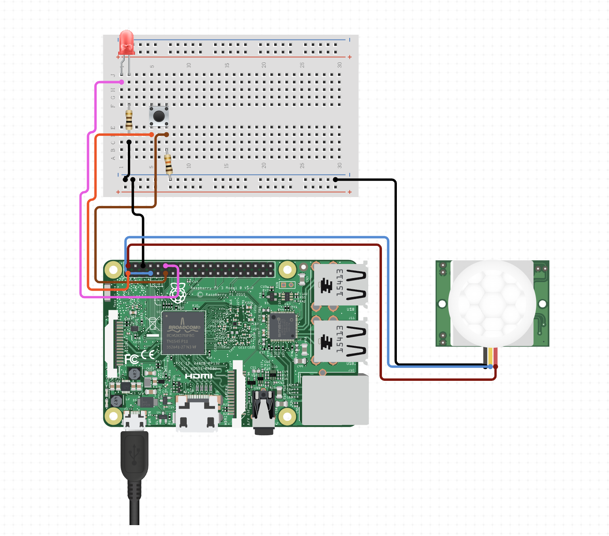
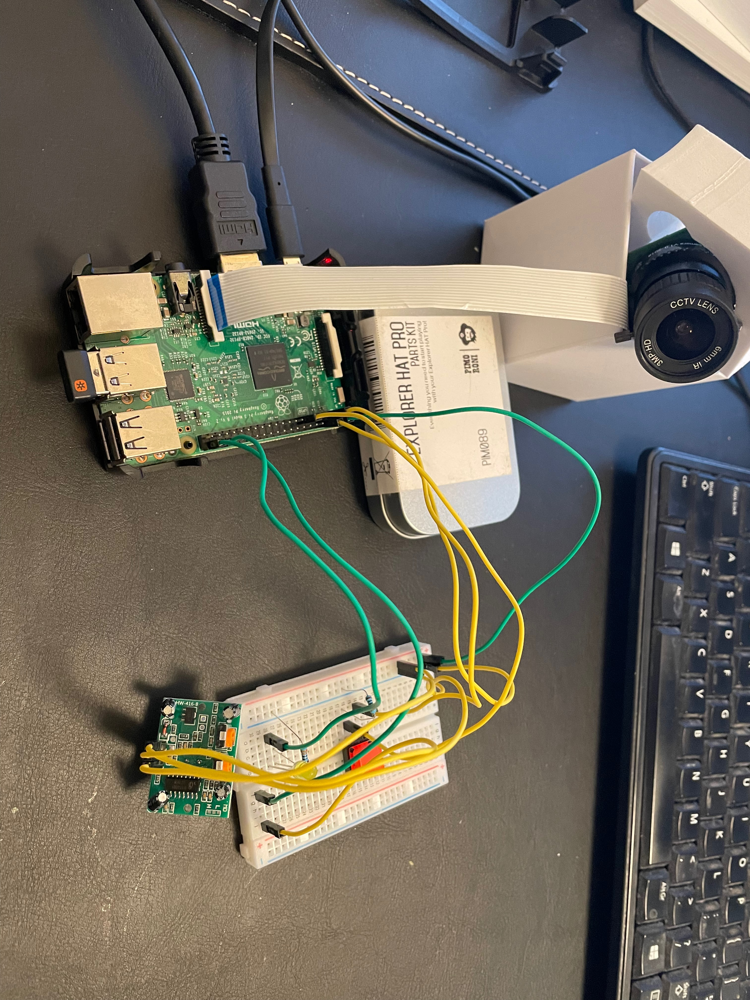
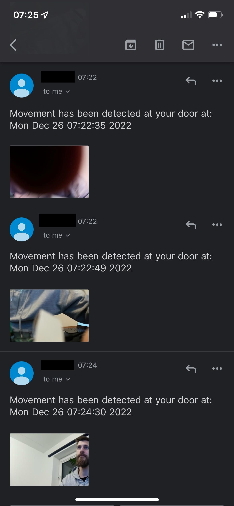

# DurvjuKamera
Durvju kamera, displeju un kustību sensoru.

Dzīvojot daudzdzīvokļu mājas īres dzīvoklī ir vairāki iemesli papildus nodrošināt dzīvokļa durvis pret ļaunprātīgiem cilvēkiem. Rūpējoties par savu personīgo un savas mantas drošību.
1) Īres dzīvoklī balstoties uz īres līgumu nosacījumiem, īpašnieks nevar atrasties īpašumā bez īrnieka klātbūtnes, bet ir nezināms skaits personu, kam ir bijusi pieeja dzīvokļa atslēgām ar iespēju tās pavairot. 
2) Eiropā 2020. gadā tika reģistrēti 1’339’400 māju ielaušanās un 3’929’300 zādzību gadījumi.
https://ec.europa.eu/eurostat/statistics-explained/index.php?title=Crime_statistics#:~:text=%3A%20Eurostat%20(crim_off_cat)-,1%20339%20400%20burglaries%20and%203%20929%20300%20thefts%20in,and%20has%20declined%20since%20then

Alternatīvie produkti/ risinājumi:
-	Tirgus ir plašs un piesātināts ar daudzu ražotāju produktiem. Cenas svārstoties no 50EUR līdz par 600EUR par vienu tādu “Gudrā durvju zvana” komplektu.
Piemēram. Brinno Front Door Peephole Security Camera Motion Detection – Knocking Sensor. (https://www.amazon.com/Brinno-Peephole-Security-Camera-Detection/dp/B079FKD2WJ/ref=sr_1_3?keywords=door+viewer+camera&qid=1672010177&sr=8-3)
-	Problēmu ko autors redz ar esošajiem produktiem, ir ka neviens no tiem nespēj nodrošināt pietiekami labas kvalitātes attēlu, jo neizmanto optiskās lēcas. Vai ekrāns ir pārāk mazs, lai fiziski saredzētu personas otrpus durvīm.

Produkta mērķis:
•	Nodrošināt Attēla attēlošanu uz ekrāna ar HD video kameru
•	Nodrošināt Kustību sensora signālu vai Pogas (durvju zvana) nospiešanu
•	Nodrošināt SMTP e-pasta sūtīšanas konfigurāciju.
•	Nodrošinat ka kustību reģistrēšanas gadījumā uz norādīto epastu tiek nosūtīta ziņa ar foto un Laiku & Datumu.

Kustību sensora PIR konfigurācija un testēšana:
-	Kustību sensoram ir pieejami 3 izvadkanāli, 5V strāvas, Zemējuma kanāls, Signāla kanāls.
-	Kustību sesnoram ir pieejami divi kontrolieri. Ar vienu var kontrolēt sensora mērījumu noildzi (“tiemout”) laiku, otrs kontrolē mērījumu jutīgumu (“sensitivity”). 

SMTP automatizētu epastu pakalpjumu sakonfigurēšana vietnē google:
-	Divu faktoru autentifikācijas iespējošana
-	SMTP Access iespējošana
-	App Password izveidošana
-	Dienas limitu uzstādīšana

Sastāvdaļas:
-	Raspberry Pi 2 (with built-in WIFI and HDMI)
-	Breadboard (Any)
-	RPi HQ camera module 2 (https://thepihut.com/products/raspberry-pi-high-quality-camera-module)
-	CCTV LENS (https://thepihut.com/products/raspberry-pi-high-quality-camera-lens)
-	RPI Motion sensor (https://thepihut.com/products/pir-motion-sensor-module)
-	Wiring
-	Rezistor
-	Led
-	Button (Could be replaced with existing doorbell, but Bell signal voltage can be different from place to place)

- Ko atrisina Jūsu risinājums? 
Kā darbojas Jūsu risinājums? Risinājuma darbības pamatprincipi.
Produkta mērķis:
•	Nodrošināt Attēla attēlošanu uz ekrāna ar HD video kameru
•	Nodrošināt Kustību sensora signālu vai Pogas (durvju zvana) nospiešanu
•	Nodrošināt SMTP e-pasta sūtīšanas konfigurāciju.
•	Nodrošinat ka kustību reģistrēšanas gadījumā uz norādīto epastu tiek nosūtīta ziņa ar foto un Laiku & Datumu.
Raspberry Pi ar Kamera tiktu nostiprināta pie durvju “acs” dzīvokļa iekšpusē. Kustību sensors & zvana slēdzis durvju ārpusē. Nostrādājot kustību sensoram vai zvana slēdzim tiek uzņemts foto uzņēmums ar skatu uz durvju ārpusi caur durvju “acs”. Šī bilde tiek apstrādāta, saglabāta un nosūtīta uz dzīvokļa lietotāja epastu caur smtp serveri.

Kustību sensora PIR konfigurācija un testēšana:
-	Kustību sensoram ir pieejami 3 izvadkanāli - 5V strāvas, Zemējuma kanāls, Signāla kanāls.
-	Kustību sesnoram ir pieejami divi kontrolieri - Ar vienu var kontrolēt sensora mērījumu noildzi (“timeout”) laiku, otrs kontrolē mērījumu jutīgumu (“sensitivity”). 

SMTP automatizētu epastu pakalpjumu sakonfigurēšana vietnē google:
-	Divu faktoru autentifikācijas iespējošana
-	SMTP Access iespējošana
-	App Password izveidošana
-	Dienas limitu uzstādīšana

Kameras darbības iespējas:
-	Iespēja mainīt objektīvus CCTV LENS, MicroLENS, MacroLens.
-	Iespēja izvēlēties kadru skaitu sekundē (camera.framerate)
-	Iespēja izvēlēties kameras izķirtspēju (camera-resolution, max resolution = 4056x3040px)
Aprakstiet kādu datorsistēmu tipu Jūs pielietosiet realizācijā; kādus sensorus/aktuatorus tā izmantos datu vākšanai/darbību veikšanai.
-	Raspberry Pi 3 B
-	RPi HQ camera module 2 (https://thepihut.com/products/raspberry-pi-high-quality-camera-module)
-	CCTV LENS (https://thepihut.com/products/raspberry-pi-high-quality-camera-lens)
-	RPI Motion sensor (https://thepihut.com/products/pir-motion-sensor-module)
-	Rezistors
-	Led lampiņa
-	Button (Could be replaced with existing doorbell, but Bell signal voltage can be different from place to place)

Kā Jūsu sistēma komunicēs (definējiet komunikācijas veidu)?
-	Lietotāja darbībai ar Raspberry pi  un to konfigurēšanai - VNC serveris.
-	Ziņojums sūtīšanai - bezvadu tīklu “WIFI” sazinās ar ‘smtp.gmail.com’, lai autorizētos un veiktu e-mail sūtīšanu.
-	Sensoru, slēdžu un led ir saslēgti 5V shēmā.
Kā Jūs nodrošināsiet sistēmas/savākto datu drošību?
-	VNC serverim tiek mainīta Raspberry pi parole.
-	SMTP pieslēgumam gmail ir sakonfigurēta atsevišķa iekārtas parole (‘App password’)

Schēma:

Praktiskais prototips:

Epasta rezultāts:

